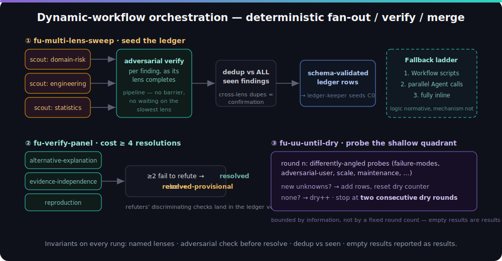

<p align="center"><strong>English</strong> | <a href="README.zh.md">简体中文</a></p>

<p align="center">
  
</p>

<p align="center">
  
  
  
  
  
</p>

<p align="center"><em>The map is not the territory. The quality of long-horizon work is bounded by how well you clarify your <strong>unknowns</strong>.</em></p>

`finding-unknowns` is a Claude Code skill-and-agent framework that helps you surface what you
do not yet know — before, during, and after implementation — so that ambiguity is resolved
with cheap questions up front rather than expensive rework later. A single orchestrating
skill provides eight discovery techniques and a rigorous gated mode; four companion agents
back the techniques where isolation, divergence, or independent judgement pays.

> **Attribution.** This skill distills Thariq Shihipar's essay _"A Field Guide to Fable:
> Finding Your Unknowns"_ ([@trq212](https://x.com/trq212/status/2073100352921215386)). Credit
> for the underlying ideas and technique names belongs to the original author; this repository
> packages them as an installable Claude Code skill.

---

## Overview

The **map** is what you give Claude (the prompt, context, and skills). The **territory** is
where the work actually happens (the codebase and the real world). The gap between them is
made of unknowns, and every unknown forces the model to guess your intent.

This skill provides eight concrete techniques for surfacing those unknowns across the full
task lifecycle, plus an optional rigorous mode ("Cartographer mode") for high-stakes work.

<p align="center">
  
</p>

## Features

- **Four-quadrant framing** — classify a gap as a known or unknown unknown before acting.
- **Blind-spot pass** — surface the unknowns you were not aware you had, tuned to your context.
- **Brainstorm and prototype** — react to several throwaway directions before committing code.
- **Interview** — one question at a time, prioritising answers that change the architecture.
- **References** — treat existing source code as the richest available specification.
- **Implementation plan** — lead with the decisions most likely to change.
- **Implementation notes** — record deviations during the build for later review.
- **Pitch and quiz** — a review artifact for buy-in, and a comprehension check before merge.
- **Cartographer mode** — an ambiguity-scored, coverage-gated, regret-weighted protocol backed by a persistent ledger, ending in an approval-gated execution bridge.
- **Companion agents** — four specialists (`blindspot-scout`, `prototype-smith`,
  `ledger-keeper`, `quiz-master`) to which the skill delegates when additional depth is warranted.

## Architecture

The framework is layered — commands dispatch, the skill decides, agents execute, documents
persist. Procedure lives in exactly one place (`SKILL.md`); every other layer either enters
it or carries out a contract from it. Every technique works standalone — commands and
agents are enhancements, not dependencies. See [docs/ARCHITECTURE.md](docs/ARCHITECTURE.md)
for the full design reference.

| Layer | Contents | Role |
|-------|----------|------|
| Commands | `/finding-unknowns` `/blindspot` `/cartographer` `/change-quiz` | Thin entry points; name a skill section, pass arguments |
| Skill | `SKILL.md` | The protocol: quadrant routing, eight techniques, Cartographer mode, guardrails |
| Agents | four specialists | Isolated execution profiles with explicit I/O contracts |
| Artifacts | ledger, notes, prototypes, report | Persistent state; the ledger is the resume point |
| Workflows | `references/workflows.md` | Optional dynamic-workflow scripts for the fan-out-heavy operations; degrade to plain agents or inline |

<p align="center">
  
</p>

| Agent | Model | Backs | Execution profile |
|-------|-------|-------|-------------------|
| `blindspot-scout` | sonnet | Blind-spot pass, References | Read-only reconnaissance; explores in its own context window and structurally cannot start implementing |
| `prototype-smith` | inherit | Brainstorm & prototype, Implementation plan | Sandboxed to new throwaway files; produces N genuinely divergent directions in one pass |
| `ledger-keeper` | inherit | Cartographer mode | Independent bookkeeper for the unknowns ledger; scores regret, scores per-quadrant clarity into a weighted ambiguity figure, and rules on the dual coverage+ambiguity gate without grading its own work |
| `quiz-master` | inherit | Quiz, Pitch & explainer | Fresh-eyes examiner that did not author the change; probes what the author would gloss over |

The separation follows one principle: **discovery, scoring, and examination should not be
performed by the same context that implements.** A scout that cannot edit files cannot
drift into building; a bookkeeper that did not conduct the interview will not inflate its
gate verdict; an examiner that did not write the diff asks harder questions.

## The four quadrants

Locate where an unknown lives; the quadrant indicates which technique to use.

<p align="center">
  
</p>

## Requirements

- **Claude Code** — the CLI, desktop app, or an IDE extension. The skill loads through the
  Skill tool (or `~/.claude/skills/`); the slash commands need the plugin or a manual copy.
- **No runtime, no dependencies.** The skill, agents, and commands are plain Markdown.
  Nothing is compiled or installed beyond copying files.
- **Optional enhancements, all degrade gracefully:** the four companion agents (used when
  additional depth is warranted), and the Workflow tool for dynamic-workflow orchestration —
  every technique also runs fully inline with neither installed.
- **`bash`** for `install.sh` (Option B). Options A, C, and D need no shell.

## Installation

**Option A — plugin marketplace (recommended):**

```
/plugin marketplace add baizhiyuan/finding-unknowns-skill
/plugin install finding-unknowns@finding-unknowns-skill
```

**Option B — clone and install:**

```bash
git clone https://github.com/baizhiyuan/finding-unknowns-skill.git
cd finding-unknowns-skill
bash install.sh              # installs the skill and the four companion agents
```

**Option C — passive drop-in (no installation):** copy [`CLAUDE.md`](CLAUDE.md) into a project
root for lightweight, always-on guidance.

**Option D — manual copy:**

```bash
mkdir -p ~/.claude/skills/finding-unknowns/references
cp skills/finding-unknowns/SKILL.md ~/.claude/skills/finding-unknowns/
cp skills/finding-unknowns/references/*.md ~/.claude/skills/finding-unknowns/references/
```

## Updating

To update an existing installation to the latest release (**v3.7.0**), follow the procedure
matching the original installation method.

**Updating Option A — plugin marketplace:**

```
/plugin marketplace update finding-unknowns-skill
/plugin update finding-unknowns@finding-unknowns-skill
```

**Updating Option B — clone and install:** re-run the installer after pulling. `install.sh`
overwrites in place (skill, `references/`, the four agents, and the slash commands), so it
doubles as the updater.

```bash
cd finding-unknowns-skill
git pull origin main
bash install.sh              # re-copies skill + references + agents + commands
```

**Updating Option D — manual copy:** overwrite the same files (the `references/` directory
carries the Workflow-orchestration templates and must be updated too).

```bash
cd finding-unknowns-skill && git pull origin main
mkdir -p ~/.claude/skills/finding-unknowns/references
cp skills/finding-unknowns/SKILL.md ~/.claude/skills/finding-unknowns/
cp skills/finding-unknowns/references/*.md ~/.claude/skills/finding-unknowns/references/
cp agents/*.md   ~/.claude/agents/
cp commands/*.md ~/.claude/commands/
```

After updating, verify that the installed version matches the release:

```bash
grep '"version"' ~/.claude/plugins/*/finding-unknowns*/.claude-plugin/plugin.json 2>/dev/null \
  || grep -c '### Model routing' ~/.claude/skills/finding-unknowns/SKILL.md
# expect: 3.7.0 (plugin) — or a non-zero count confirming the v3.7.0 Model routing section
```

## Configuration

The skill runs with **zero configuration** — every knob below is optional and has a
sensible default.

**Clarity threshold (Cartographer mode).** The weighted-ambiguity gate defaults to `0.25`.
Override it per project or per user in `.claude/settings.json` (project overrides user):

```json
{
  "findingUnknowns": {
    "ambiguityThreshold": 0.25
  }
}
```

On entry, Cartographer reports the resolved threshold and its source.

**Depth presets.** A flag on the command overrides any settings value:

| Flag | Threshold | Use for |
|------|-----------|---------|
| `/cartographer --quick <task>` | 0.35 | quick orientation, lower-stakes work |
| `/cartographer --standard <task>` | 0.25 (default) | most tasks |
| `/cartographer --deep <task>` | 0.15 | high-stakes, hard-to-reverse work |

**Other defaults** (prototype directions, the regret question bar, quiz size and rounds,
the Cartographer round caps, up to three independent interview questions per round) are
documented in the **Defaults** table inside [`SKILL.md`](skills/finding-unknowns/SKILL.md)
and may be overridden through a natural-language instruction to the skill.

**Model routing.** The judgment and creative agents — `ledger-keeper`, `prototype-smith`,
and `quiz-master` — are declared with `model: inherit`, so they run at the session's active
model rather than a fixed tier. `blindspot-scout` is pinned to `sonnet`, since
reconnaissance runs as a parallel fan-out; it may be set to `inherit` in its frontmatter for
single-lens passes. The scheme follows the role-based convention of OMC (strongest model for
judgment, mid-tier for execution, lowest for breadth) and Deep Research (strongest model at
the synthesis centre, cheaper models for fan-out). See
[docs/ARCHITECTURE.md](docs/ARCHITECTURE.md) for the rationale.

## Usage

At the start of an ambiguous or unfamiliar task, invoke the skill through the Skill tool:

```
finding-unknowns
```

With the plugin installed, slash commands provide direct entry points:

| Command | Enters at |
|---------|-----------|
| `/finding-unknowns <task>` | Phase 0 — quadrant routing, then the matching technique |
| `/blindspot <goal or area>` | Blind-spot pass (reconnaissance only) |
| `/cartographer <task>` | Cartographer mode — ledger, score-gated clearing loop, dual gate, execution bridge |
| `/change-quiz [diff range]` | Change report + must-pass comprehension quiz |

Individual techniques can also be requested in plain language, for example: _"do a
blind-spot pass"_, _"interview me"_, or _"brainstorm four directions"_. See
[`EXAMPLES.md`](EXAMPLES.md) for complete, copy-paste prompts.

## The eight techniques

| Phase  | Technique              | Use for                                          |
|--------|------------------------|--------------------------------------------------|
| Pre    | Blind-spot pass        | Unknown unknowns in a new domain or codebase     |
| Pre    | Brainstorm & prototype | Unknown knowns — "I'll know it when I see it"     |
| Pre    | Interview              | Residual ambiguity after brainstorming           |
| Pre    | References             | When you cannot describe it — point at code      |
| Pre    | Implementation plan    | Surface the risky decisions early                |
| During | Implementation notes   | Edge cases that force a deviation                |
| Post   | Pitch & explainer      | Buy-in and approvals                             |
| Post   | Quiz                   | Confirm understanding before merge               |

Full prompts for each technique are documented in
[`skills/finding-unknowns/SKILL.md`](skills/finding-unknowns/SKILL.md).

## Cartographer mode

The eight techniques are lightweight probes. Cartographer mode is the rigorous escalation for
high-stakes work: a gated interview that does not permit implementation until the problem space
is adequately mapped. It is inspired by the Deep Interview skill in
[oh-my-claudecode](https://github.com/Yeachan-Heo/oh-my-claudecode): since v3.6.0 it
*adopts* Deep Interview's transparency machinery — per-quadrant clarity scores rolled into
a weighted ambiguity figure with a configurable threshold, a Round 0 topology confirmation,
and challenge modes — while keeping the axes a clarity-scoring interview alone does not
address.

<p align="center">
  
</p>

| Axis              | Deep Interview                          | Cartographer mode                                                        |
|-------------------|-----------------------------------------|--------------------------------------------------------------------------|
| Gate criterion    | Ambiguity ≤ threshold (goal/constraint/criteria dimensions) | Dual: coverage (all four quadrants probed, blind-spot pass required) AND per-quadrant weighted ambiguity ≤ threshold |
| Blind spots (UU)  | Not modelled                            | First-class; heaviest weight (0.30) in the ambiguity formula             |
| Lifecycle         | Ends at the specification               | One ledger, seeded pre, appended during, closed post                     |
| Prioritisation    | Fixed dimension weights                 | Regret = cost-if-wrong × P(wrong) orders rows; ambiguity scores quadrants |
| Clearing instrument | Socratic Q&A only                     | Route-typed per unknown: interview / territory-verify / experiment / audit — the loop is a router, not an interview |
| Execution handoff | Bridges into OMC pipelines              | Approval-gated bridge: independent planner+reviewer consensus, or Workflow execution with per-task refute-framed verification |

The mechanism is a persistent unknowns ledger (`id · quadrant · cost-if-wrong · P(wrong) ·
regret · route · status · phase`) whose header records the clarity threshold, the locked
topology, and a per-round quadrant score history. Each round clears the highest-regret open
row by its route, then re-scores all four quadrants and shows the user the score table —
`ambiguity = 1 − (KK×0.20 + KU×0.25 + UK×0.25 + UU×0.30)`, threshold 0.25 by default
(`--quick` 0.35 / `--deep` 0.15). Implementation may not start while any quadrant is
un-probed, any open row carries `regret ≥ 1.0`, or ambiguity sits above threshold; a gate
PASS crystallizes a pending-approval spec that feeds the cross-validated execution bridge.
The full schema and kick-off prompt are in [`SKILL.md`](skills/finding-unknowns/SKILL.md).

When the host exposes Claude Code's **Workflow tool** (dynamic workflows) and the user has
opted into orchestration, the fan-out-heavy operations run as deterministic scripts —
multi-lens sweep with per-finding adversarial verification (pipelined, no barrier), a
three-lens refutation panel for cost ≥ 4 resolutions, a UU probe loop that stops only
after two consecutive dry rounds, and post-approval execution that pairs every implementer
with an independent refute-framed verifier. Templates and the graceful fallback ladder live in
[`references/workflows.md`](skills/finding-unknowns/references/workflows.md).

<p align="center">
  
</p>

## Relationship to other tools

`finding-unknowns` operates at a different altitude from heavier workflow skills. It is a
lightweight orienting layer, not an execution engine.

| Property     | finding-unknowns          | Deep Interview ([OMC](https://github.com/Yeachan-Heo/oh-my-claudecode)) | OMC execution (autopilot / ralph / team) | [Superpowers](https://github.com/obra/superpowers) |
|--------------|---------------------------|-------------------------|------------------------|------------------------|
| Altitude     | Meta / orienting          | One phase: requirements | Execution & delivery   | Discipline primitives  |
| Lifecycle    | Pre · During · Post       | Pre only                | During · Post          | Mostly single-phase    |
| Rigor        | Flexible                  | Ambiguity gating        | Verification-gated     | Checklist-driven        |
| State        | Stateless                 | Persisted, resumable    | Persisted, multi-agent | Varies                 |
| Best when    | You do not yet know your unknowns | You need a validated specification | The specification is clear | You need one disciplined move |

These tools are complementary rather than competing. The recommended pattern is to use
`finding-unknowns` to locate an unknown, then escalate to the appropriate specialist:

```
finding-unknowns  (orient: which quadrant is this unknown in?)
        ├─ a light reframe is sufficient          → the eight techniques
        ├─ high-stakes, want a coverage gate       → Cartographer mode (this skill)
        ├─ want ambiguity gating + resumable state → OMC Deep Interview
        ├─ divergent option generation             → superpowers:brainstorming
        ├─ a rigorous written plan                 → superpowers:writing-plans / omc-plan
        └─ the specification is already concrete    → OMC autopilot / ralph / team
```

## Project structure

```
finding-unknowns-skill/
├── .claude-plugin/         Plugin and marketplace manifests (/plugin install)
├── commands/               Slash-command entry points (thin dispatchers)
│   ├── finding-unknowns.md   /finding-unknowns — Phase 0 routing
│   ├── blindspot.md          /blindspot — blind-spot pass
│   ├── cartographer.md       /cartographer — Cartographer mode
│   └── change-quiz.md        /change-quiz — report + merge quiz
├── skills/
│   └── finding-unknowns/
│       ├── SKILL.md        The protocol: routing, eight techniques, Cartographer mode
│       └── references/
│           └── workflows.md  Workflow-orchestration templates (multi-lens sweep, verify panel, UU loop)
├── agents/
│   ├── blindspot-scout.md  Read-only reconnaissance (sonnet)
│   ├── prototype-smith.md  Divergent throwaway prototyping (inherit)
│   ├── ledger-keeper.md    Regret scoring and coverage-gate verdicts (inherit)
│   └── quiz-master.md      Independent examiner (inherit)
├── docs/
│   └── ARCHITECTURE.md     Design reference: layers, contracts, principles
├── assets/                 README diagrams (SVG)
├── AGENTS.md               Repository guide for coding agents and contributors
├── EXAMPLES.md             Copy-paste, end-to-end prompts
├── CLAUDE.md               Passive single-file drop-in
├── install.sh              Installer (skill + references + agents + commands)
├── CONTRIBUTING.md         Contribution guidelines
├── CHANGELOG.md            Release history
├── LICENSE                 MIT
├── README.md               English (canonical)
└── README.zh.md            简体中文 translation
```

## Contributing

Contributions are welcome. Please see [CONTRIBUTING.md](CONTRIBUTING.md) for guidelines.

## Acknowledgements

- The ideas and technique names originate from Thariq Shihipar's essay _"A Field Guide to
  Fable: Finding Your Unknowns"_ ([@trq212](https://x.com/trq212/status/2073100352921215386)).
- The Cartographer mode comparison references the Deep Interview skill from
  [oh-my-claudecode](https://github.com/Yeachan-Heo/oh-my-claudecode) and the primitives in
  [Superpowers](https://github.com/obra/superpowers).

## License

Released under the MIT License. See [LICENSE](LICENSE).

## Disclaimer

This is an independent community project. It is not affiliated with, authorised by, or endorsed
by Anthropic.
