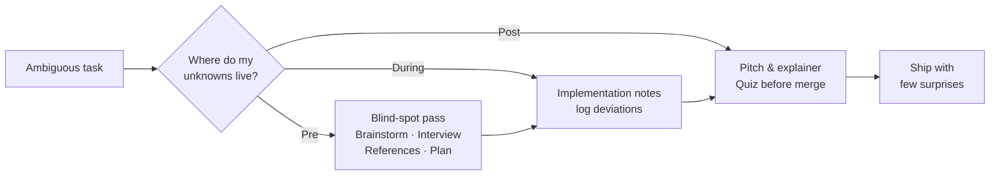

# finding-unknowns · A Claude Code Skill


> **The map is not the territory.**
> The quality of long-horizon work isn't bottlenecked by the model anymore — it's
> bottlenecked by your ability to clarify your *unknowns*.

* * *

## 💡 What this skill does

`finding-unknowns` is a toolbox for **discovering your unknowns cheaply — before they get
expensive to fix.** The **map** is what you give Claude (prompt, context, skills). The
**territory** is where the work actually happens (the codebase, the real world). The gap
between them is unknowns, and every unknown forces Claude to guess what you want.

This skill gives Claude _eight concrete techniques_ to surface those unknowns **before,
during, and after** implementation — so you spend cheap words up front instead of expensive
rework later.

* * *

## ✨ Key features

- 🧭 **Four-quadrant framing** — locate whether your gaps are _known unknowns_ or _unknown unknowns_ before you act.
- 🔦 **Blind-spot pass** — Claude teaches you the gaps you didn't know you had, tuned to who you are.
- 🎨 **Brainstorm & prototype** — react to N wildly different HTML directions before anything gets wired up.
- 🎤 **Interview me** — one question at a time, prioritizing answers that change the architecture.
- 📎 **References** — point Claude at source code as the richest possible spec, even across languages.
- 📋 **Implementation plan** — leads with the decisions you're most likely to tweak, buries the mechanical parts.
- 📝 **Implementation notes** — logs deviations mid-build so you learn from each attempt.
- 🎓 **Pitch & quiz** — a buy-in doc for reviewers, and a quiz you must pass before you merge.

* * *

## 🏗️ How it works



The skill teaches Claude to first locate your unknowns on the classic 2×2, then reach for
the right technique for that phase:

| | You're aware of it | You're **not** aware of it |
|---|---|---|
| **You know it** | Known Knowns — what's in your prompt | **Unknown Knowns** — know-it-when-you-see-it criteria |
| **You don't know it** | Known Unknowns — gaps you can name | **Unknown Unknowns** — blind spots |

> Every explainer, brainstorm, interview, prototype, and reference is a cheap way to find
> out what you didn't know — before it gets expensive to fix.

* * *

## 🚀 Quickstart

**Option A — one-line install (clone + run):**

```bash
git clone https://github.com/baizhiyuan/finding-unknowns-skill.git
cd finding-unknowns-skill
bash install.sh              # copies SKILL.md into ~/.claude/skills/finding-unknowns/
```

**Option B — manual copy:**

```bash
mkdir -p ~/.claude/skills/finding-unknowns
cp skills/finding-unknowns/SKILL.md ~/.claude/skills/finding-unknowns/
```

Then, at the start of any ambiguous task, **invoke it via the Skill tool**:

```
finding-unknowns
```

Or just tell Claude the trigger phrases it listens for — _"do a blindspot pass"_,
_"interview me"_, _"brainstorm 4 directions"_.

* * *

## 📁 Project structure

```
finding-unknowns-skill/
├── skills/
│   └── finding-unknowns/
│       └── SKILL.md        # the skill itself — frontmatter + 8 techniques
├── install.sh              # copies the skill into ~/.claude/skills/
├── LICENSE                 # MIT
└── README.md               # you are here
```

* * *

## 🧩 The eight techniques

| Phase | Technique | For |
|-------|-----------|-----|
| Pre | 🔦 Blind-spot pass | Unknown unknowns in a new domain / codebase |
| Pre | 🎨 Brainstorm & prototype | Unknown knowns — "I'll know it when I see it" |
| Pre | 🎤 Interview me | Residual ambiguity after brainstorming |
| Pre | 📎 References | When you can't describe it — point at code |
| Pre | 📋 Implementation plan | Surface the risky decisions early |
| During | 📝 Implementation notes | Edge cases that force a deviation |
| Post | 🎓 Pitch & explainer | Buy-in and approvals |
| Post | ✅ Quiz | Understand the change before you merge |

Full copy-paste prompts for each live inside [`skills/finding-unknowns/SKILL.md`](skills/finding-unknowns/SKILL.md).

* * *

## 🙌 Acknowledgements

The workflow is distilled from the essay _"The map is not the territory"_ on discovering
your unknowns when working with capable coding models. This repo packages those ideas as an
installable Claude Code skill.

* * *

## 📄 License

MIT — see [LICENSE](LICENSE). Contributions and updates welcome; this skill will keep evolving.
